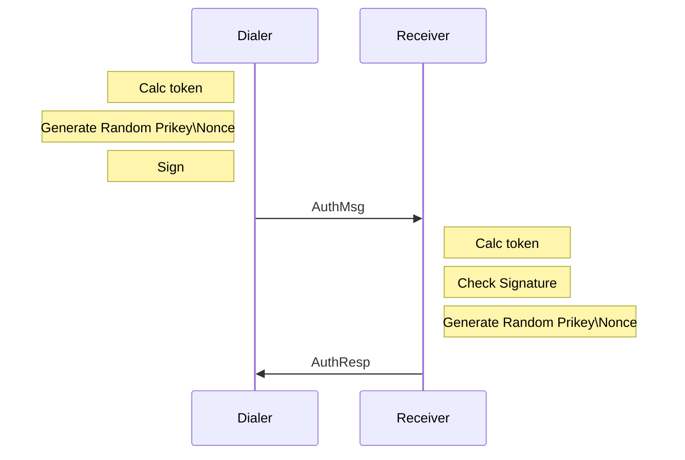
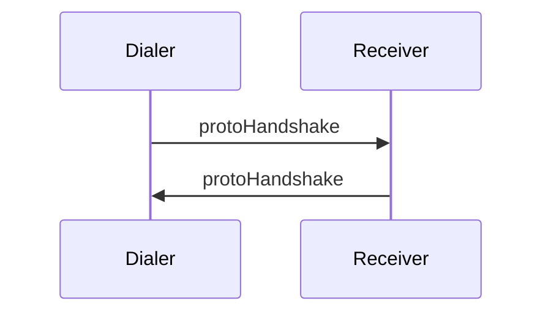

## 前言
 **p2p**(**peer to peer**)负责以太坊底层节点间的通信，主要包括底层节点发现(**discover**)和上层协议运行两大部分。

## 节点发现

节点发现功能主要涉及 **Server** \ **Table** \ **udp** 这几个数据结构，它们有独自的事件响应循环，节点发现功能便是它们互相协作完成的。其中，每个以太坊客户端启动后都会在本地运行一个**Server**，并将网络拓扑中相邻的节点视为**Node**，而**Table**是**Node**的容器，**udp**则是负责维持底层的连接。这些结构的关系如下图


### Server
```golang
p2p/server.go
type Server struct {
    PrivateKey  *ecdsa.PrivateKey
    Protocols    []protocol
    StaticNodes[]  *discover.Node
    newTransport  func(net.Conn)  transport  
    ntab    disvocerTable    
    ourHandshake    *protoHandshake    

    addpeer    chan *conn
    ......
}
```
**PrivateKey** -  本节点的私钥，用于与其他节点建立时的握手协商
**Protocols**  - 支持的所有上层协议
**StaticNodes** - 预设的静态**Peer**，节点启动时会首先去向它们发起连接，建立邻居关系
**newTransport**  - 下层传输层实现，定义握手过程中的数据加密解密方式，默认的传输层实现是用**newRLPX()**创建的**rlpx**，这不是本文的重点
**ntab** - 典型实现是`Table`，所有**peer**以**Node**的形式存放在`Table`
**ourHandshake**  - 与其他节点建立连接时的握手信息，包含本地节点的版本号以及支持的上层协议
**addpeer** － 连接握手完成后，连接过程通过这个通道通知`Server`

#### Server.listenLoop()
`Server`的监听循环，启动底层监听socket，当收到连接请求时，Accept后调用**setupConn()**开始连接建立过程

#### Server.run()
Server的主要事件处理和功能实现循环
*  进行主动的节点发现，详见之后的节点发现部分
* **posthandshake** channel 接收已经完成第一阶段的连接，这些连接的身份已经被确认，但还需要验证
* **addpeer** channel 接收已经完成第二阶段的连接，这些连接已经验证，调用**runPeer()**运行本节点与**Peer**连接上的协议

### Node
**Node**唯一表示网络上的一个节点
```golang
p2p/discover/node.go
type Node struct {
    IP net.IP
    UDP, TCP uint16
    ID      NodeID
    sha    common.Hash
}
```
**IP** - IP地址
**UDP/TCP** - 连接使用的UDP/TCP端口号
**ID** - 以太坊网络中唯一标识一个节点，本质上是一个椭圆曲线公钥(PublicKey)，与`Server`的**PrivateKey**对应。一个节点的IP地址不一定是固定的，但ID是唯一的。
**sha** - 用于节点间的距离计算
****

### Table
`Table`主要用来管理与本节点与其他节点的连接的建立\更新\删除
```golang
p2p/discover/table.go
type Table struct {
    bucket   [nBuckets]* bucket
    refreshReq    chan chan struct{}
    ......
}
```
**bucket** - 所有**peer**按与本节点的距离远近放在不同的桶(bucket)中，详见之后的**节点维护**
**refreshReq** - 更新`Table`请求通道


#### Table.loop()
`Table`的主要事件循环，主要负责控制**refresh**和**revalidate**过程。
**refresh.C** - 定时(30s)启动Peer刷新过程的定时器
**refreshReq**  - 接收其他线程投递到`Table`的**刷新Peer连接**的通知，当收到该通知时启动更新，详见之后的**更新邻居关系**
**revalidate.C** - 定时重新检查以连接节点的有效性的定时器，详见之后的**探活检测**  


### udp
`udp`负责节点间通信的底层消息控制，是`Table`运行的`Kademlia`协议的底层组件
```golang
type udp struct {
    conn  conn
    addpending chan *pending
    gotreply  chan reply
    *Table
}
```
**conn** - 底层监听端口的连接
**addpending** －`udp`用来接收**pending**的channel。使用场景为：当我们向其他节点发送数据包后(packet)后可能会期待收到它的回复，pending用来记录一次这种还没有到来的回复。举个例子，当我们发送ping包时，总是期待对方回复pong包。这时就可以将构造一个pending结构，其中包含期待接收的pong包的信息以及对应的callback函数，将这个pengding投递到udp的这个channel。`udp`在收到匹配的pong后，执行预设的callback。
**gotreply** - `udp`用来接收其他节点回复的通道，配合上面的addpending，收到回复后，遍历已有的pending链表，看是否有匹配的pending。
**Table** - 和`Server`中的ntab是同一个`Table`

#### udp.loop()
`udp`的处理循环，负责控制消息的向上递交和收发控制
* **addpending** 接收其他线程投递来的pending需求
* **gotreply** 接收**udp.readLoop()**投递过来的pending的回复

#### udp.readLoop()
`udp`的底层接受数据包循环，负责接收其他节点的**packet**
* 接受其他节点发送的packet并解析，如果是回复包则投递到**udp.loop()**

---

## 节点维护
以太坊使用`Kademlia`分布式路由存储协议来进行网络拓扑维护，了解该协议建议先阅读[易懂分布式](https://www.jianshu.com/p/f2c31e632f1d)。更权威的资料可以查看[wiki](https://en.wikipedia.org/wiki/Kademlia)。总的来说该协议：
* 使用UDP进行节点间消息通信，有 **4** 种消息
    * **ping** - 用于探测其他节点是否还存在
    * **store** - 接收者受到后，将信息中key/value对存储在本节点
    * **findnode** - 接受者向发送者返回 **k** 个它知道的与目标结点距离最近的节点
    * **findvalue** - 和**findnode** 差不多，区别是如果接收者本地存在与目标结点对应的value，那么就回复这个值给发送者。
* 每个节点根据与邻居节点距离之间的距离(NodeID的差距)，分别放到不同的桶(**bucket**)中。

> 本文说的距离，均是指两个节点NodeID的距离，计算方式可见**p2p/discover/node.go**的**logdist()**方法

源码中由`Table`结构保存所有**bucket**，**bucket**结构如下
```golang
p2p/discover/table.go
type bucket struct {
    entries  []*Node
    replacemenets   []*Node
    ips  netutil.DistinctNetSet
}
```
* **entries** 数组中保存经过**bond**的节点，并且其顺序是越新**bond**通过了探活检测(**Revalidate**)的节点位置越靠前。
* **replacemenets**数组中保存候补节点，如果**entries** 数组数量满了，之后的节点会被加入该数组

节点可以在**entries**和**replacements**互相转化，一个**entries**节点如果**Validate**失败，那么它会被原本将一个原本在**replacements**数组的节点替换。

####探活检测(Revalidate)
有效性检测就是利用**ping**消息进行探活操作。**Table.loop()**启动了一个定时器（0~10s），定期随机选择一个bucket，向其**entries**中末尾的节点发送**ping**消息，如果对方回应了**pong**，则探活成功。

> 举个栗子，假设某个bucket， **entries**最多保存2个节点，**replacements**最多保存4个节点。初始情况下**entries**=[A, B], **replacements** =  [C, D, E]，如果此时节点F加入网络，**bond**通过，由于**entries**已满，只能加入到**replacements** =  [C, D, E, F]。 此时Revalidate定时器到期，则会对 B进行检测，如果通过，则**entries**=[B, A]，如果不通过，则将随机选择**replacements**中的一项（假设为D）替换B的位置，最终**entries**=[A, D]，**replacements** =  [C, E, F]

### **更新邻居关系**
**Table.loop()**会定期（定时器超时）或不定期（收到refreshReq）地进行更新邻居关系（发现新邻居），两者都调用**doRefresh()**方法，该方法对在网络上查找离自身和三个随机节点最近的若干个节点。

### 节点查找
`Table`的**lookup()**方法用来实现节点查找目标节点，它的实现就是`Kademlia`协议，通过节点间的接力，一步一步接近目标。

## 邻居初始化
当一个节点启动后，它会首先向配置的静态节点发起连接，发起连接的过程称为**Dial**，源码中通过创建**dialTask**跟踪这个过程

### dialTask
dialTask表示一次向其他节点主动发起连接的任务
```golang
p2p/dial.go
type dialTask struct {
    flags    connFlag
    dest    *discover.Node
    ......
}
```
在`Server`启动时，会调用**newDialState()**根据预配置的**StaticNodes**初始化一批**dialTask**， 并在**Server.run()**方法中，启动这些这些任务。


**Dial**过程需要知道目标节点(**dest**)的IP地址，如果不知道的话，就要先使用 **recolve()**解析出目标的IP地址，怎么解析？就是先要用借助`Kademlia`协议在网络中查找目标节点。


当得到目标节点的IP后，下一步便是建立连接，这是通过**dialTask.dial()**建立连接

## 连接建立
连接建立的握手过程分为两个阶段，在在**SetupConn()**中实现
第一阶段为[ECDH密钥建立](https://en.wikipedia.org/wiki/Elliptic_curve_Diffie%E2%80%93Hellman)：



第二阶段为协议握手,互相交换支持的上层协议




如果两次握手都通过，dialTask将向`Server`的**addpeer**通道发送**peer**的信息

```mermaid
sequenceDiagram
participant Server.run()
participant dialTask
participant Remote Node
dialTask->>Remote Node:EncHandshake
Remote Node->>dialTask:EncHandshake
dialTask->>Server.run(): posthandshake
dialTask->>Remote Node:ProtoHandshake
Remote Node->>dialTask:ProtoHandshake
dialTask->>Server.run(): addpeer
Note over Server.run(): go runPeer()
```

## 协议运行
**协议运行**并不单单指某个特定的协议，准确地说应该是若干个独立的协议同时在两个节点间运行。在[p2p节点发现](https://www.jianshu.com/p/94d02a41a146)提到过，节点间建立连接的时候会经过两次握手，其中的第二次握手，节点间会交换自身所支持的协议。最终两个节点间生效的协议为两个节点支持的协议的**交集**。

功能主要涉及 **Peer** \ **protoRW**  这几个数据结构，其关系如图


### Peer

* **rw** - 节点间连接的底层信息，比如使用的socket以及对端节点支持的协议(capabilities)
* **running** - 节点间生效运行的协议簇

**Peer.run()**负责连接建立后启动**运行**上层协议，它自身运行在一个独立的go routine，具有自己的事件处理循环，除此之外，它还会额外创建**2+n**个**go routine**, 其中**2**包括一个用于保活的**pingLoop()** go routine和一个用于接收协议数据的**readLoop()** go routine ，而 **n** 为运行于其上的**n**个协议的go routine，即每个协议调用自己的**Run()**方法运行在自己单独的go routine


#### protoRW
**Run**  每种协议自身的运行入口,以新的go routine形式启动.


## 总结
* p2p主要由底层节点发现和上层协议运行两部分组成，节点发现负责管理以太坊网络中各个节点间的连接建立,更新和删除，**Server**是p2p功能的入口，**Table**负责记录**peer**节点信息， **udp**负责底层通信。而在底层的基础上，节点间可以运行多个独立的协议。
* 以太坊使用`Kademlia`分布式路由存储协议来进行网络拓扑维护，将不同距离的**peer**节点放在不同的bucket中。
* 